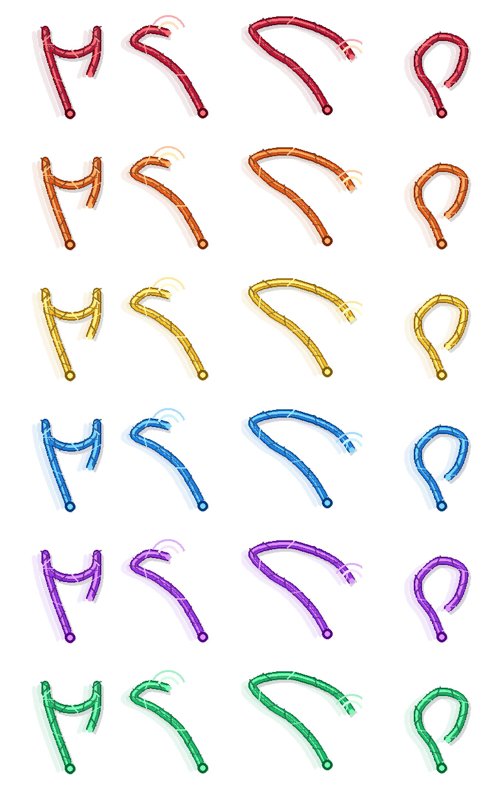

# OpenWhip Skill

> 把等待 AI 时的那句“快一点”，变成一个可见、可控、可演示的多色鞭子反馈。

OpenWhip Skill 是一个 AI 工作流交互灵感：当模型正在思考、生成、运行或看起来卡住时，用户可以用快捷键或关键词触发一条彩色鞭子动画，并配上一句短促的话术反馈。

它不是性能优化工具，也不会真的让模型变快。它更像一个情绪出口和演示道具：把等待时的焦躁感变成一个轻量、好玩、边界清晰的可视化反馈。



## What It Does

- 用多色鞭子动画表达不同工作状态。
- 用快捷键串起一条演示流程：唤醒、轻催、加速、处理卡顿、进入工作、检查收尾。
- 用关键词触发同样的反馈，例如 `快一点`、`别卡了`、`检查一下`。
- 将反馈显示在鼠标附近，让它像一个“手边的小道具”。
- 保持安全边界：不打断任务、不发送中断键、不自动输入命令、不读取隐私内容。

## Demo Flow

这套快捷键适合从左到右演示：

| Shortcut | Color | State | Message |
| --- | --- | --- | --- |
| `Option + A` | Red | Wake up | 第一鞭，先醒醒，别让我干等。 |
| `Option + S` | Orange | Nudge | 快一点，别让我在这儿干等。 |
| `Option + D` | Yellow | Speed up | 再快一点，节奏拉起来。 |
| `Option + F` | Blue | Unstick | 别卡住，往前冲。 |
| `Option + G` | Green | Work mode | 干活干活，别偷懒。 |
| `Option + H` | Purple | Review | 最后检查一遍，收工别漏东西。 |

演示时可以这样讲：

> AI 开始慢下来，先按 `Option + A` 唤醒一下；  
> 还慢，就按 `Option + S` 轻催；  
> 继续等待，就按 `Option + D` 加速；  
> 如果感觉卡住了，按 `Option + F`；  
> 等它继续干活时，按 `Option + G`；  
> 最后生成完，按 `Option + H` 做检查收尾。

## Keyword Triggers

除了快捷键，也可以用关键词触发：

| Keyword | Effect |
| --- | --- |
| `抽一下` / `甩一下` / `whip` | Red wake-up feedback |
| `快一点` | Orange nudge feedback |
| `再快一点` / `冲刺` | Yellow speed-up feedback |
| `别卡了` / `醒醒` | Blue unstick feedback |
| `干活` / `工作` | Green work-mode feedback |
| `检查一下` / `review` | Purple review feedback |

## Installation Idea

This repository is a Skill-style package and design reference. It describes the interaction model and trigger vocabulary. To run a full local animation, pair it with a local controller that can:

1. listen for shortcuts or trigger requests,
2. select an action, color, and message,
3. render the animation near the cursor,
4. hide the overlay after the animation finishes.

The Skill itself should stay lightweight: it maps user intent to OpenWhip actions and keeps the safety boundaries explicit.

## How It Works

OpenWhip can be understood as three layers:

1. **Visual assets**  
   Multiple colored whip animations represent different states.

2. **Local controller**  
   A small local process listens for shortcut events or trigger requests, then shows the animation and message bubble.

3. **Agent Skill**  
   The Skill maps natural language keywords such as `快一点` or `检查一下` into the matching action and phrase.

This separation makes the idea easy to adapt: swap the whip for another character, change the messages, or connect it to future official AI tool events.

## Safety Boundaries

OpenWhip is feedback, not control.

- It does not send interrupt keys.
- It does not stop or cancel the AI task.
- It does not type into terminals or editors.
- It does not read private chat content, browser data, accounts, or tokens.
- It should not claim to make the model faster.

The point is to make waiting feel more interactive without making automation risky.

## Repository Structure

```text
openwhip-skill/
├── README.md
├── SKILL.md
├── LICENSE
├── assets/
│   └── openwhip-preview.png
├── examples/
│   └── demo-script.md
└── references/
    └── design-notes.md
```

## License

MIT License. See [LICENSE](LICENSE).
